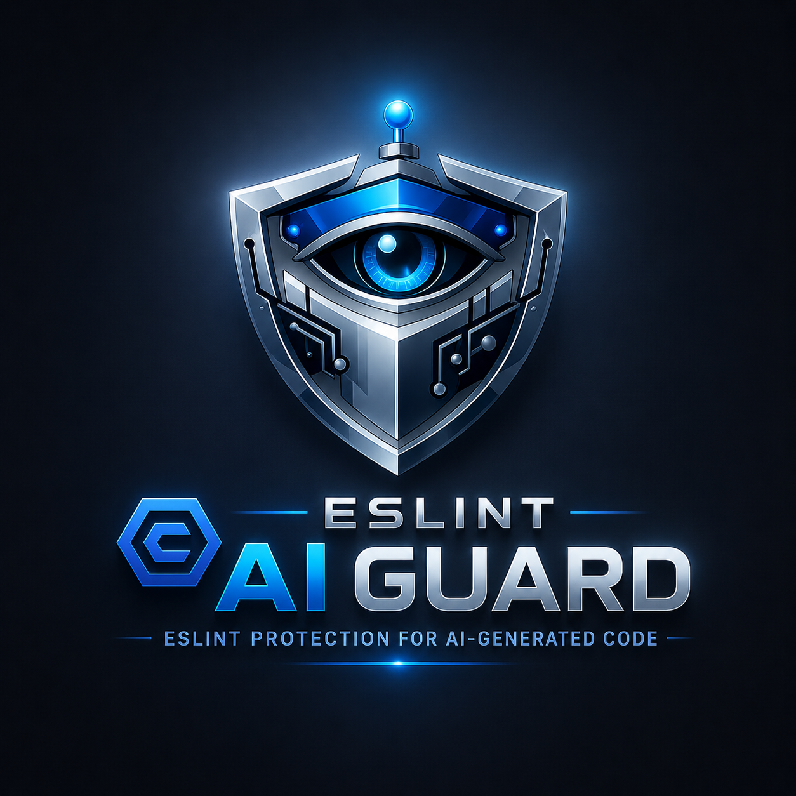

<p align="center">
  
  <h1 align="center">eslint-plugin-ai-guard</h1>
  <p align="center">
    <strong>🛡️ GitHub-native guardrails for AI-generated code.</strong>
  </p>
  <p align="center">
    <a href="https://www.npmjs.com/package/eslint-plugin-ai-guard"></a>
    <a href="https://github.com/YashJadhav21/eslint-plugin-ai-guard/actions/workflows/ci.yml"></a>
    <a href="https://www.npmjs.com/package/eslint-plugin-ai-guard"></a>
    <a href="https://github.com/YashJadhav21/eslint-plugin-ai-guard/blob/main/LICENSE"></a>
    <a href="https://github.com/YashJadhav21/eslint-plugin-ai-guard/blob/main/SECURITY.md"></a>
  </p>
</p>

---

## What is ai-guard?

**ai-guard** is an ESLint plugin and GitHub Action that catches reliability and security bugs
specific to AI-generated code — the patterns Copilot, Claude, Cursor, and Gemini consistently get wrong.

It integrates directly into GitHub pull request workflows: blocking dangerous merges, generating
SARIF reports for GitHub Code Scanning, and posting inline PR annotations at the exact line where
the bug lives.

```bash
# Scan immediately — no config needed
npx ai-guard run

# PR-aware changed-only scan with GitHub Advanced Security
npx ai-guard changed --sarif --sarif-output results.sarif
```

> [SCREENSHOT PLACEHOLDER — GitHub PR annotation showing ai-guard finding on a floating promise]

---

## The Problem

AI coding assistants generate code that **looks correct but isn't.** The patterns they get wrong
are consistent, predictable, and existing linters don't catch them:

| Pattern | Why AI Gets It Wrong |
|---------|---------------------|
| `try {} catch (e) {}` | AI adds catch blocks without handling the error |
| `array.map(async ...)` | AI generates async callbacks returning `Promise[]`, not values |
| `fetch(url)` without await | AI forgets to await or handle promise rejection |
| `const apiKey = 'sk-...'` | AI uses placeholder credentials that get committed |
| `eval(userInput)` | AI generates dynamic evaluation without security context |
| `if (true) { ... }` | AI leaves dead scaffolding branches in generated code |

ai-guard is purpose-built to catch what AI tools consistently get wrong — before those bugs reach production.

---

## Install

```bash
npm install --save-dev eslint-plugin-ai-guard
```

**Requirements:** Node.js ≥ 18 · ESLint ≥ 8

---

## Quick Start

```bash
# Zero-config project scan
npx ai-guard run

# Security-focused scan
npx ai-guard run --security

# Strict mode — all 18 rules at error
npx ai-guard run --strict

# Scan only changed files (PR-aware)
npx ai-guard changed --pr
```

**No configuration required.** ai-guard ships with a production-tuned `recommended` preset.

---

## GitHub Actions Integration

Drop this into any repository to get PR validation, SARIF-based Code Scanning, and
GitHub Advanced Security integration in under 5 minutes:

```yaml
# .github/workflows/ai-guard.yml
name: AI Guard

on: [pull_request]

permissions:
  security-events: write
  contents: read

jobs:
  scan:
    runs-on: ubuntu-latest
    steps:
      - uses: actions/checkout@v4
        with:
          fetch-depth: 0  # Required for changed-file detection

      - uses: actions/setup-node@v4
        with:
          node-version: 20
          cache: 'npm'

      - run: npm ci

      - name: Scan changed files
        run: |
          npx ai-guard changed \
            --pr \
            --strict \
            --sarif \
            --sarif-output ai-guard-results.sarif \
            --fail-on high

      - name: Upload to GitHub Code Scanning
        uses: github/codeql-action/upload-sarif@v3
        if: always()
        with:
          sarif_file: ai-guard-results.sarif
          category: ai-guard
```

This produces:
- ✅ Inline PR annotations at the exact line of each finding
- ✅ GitHub Advanced Security summary ("4 new alerts including 1 high severity")
- ✅ Persistent alerts in `Security → Code scanning`
- ✅ PR status check that blocks merges on high-severity findings

> [SCREENSHOT PLACEHOLDER — GitHub Advanced Security summary showing ai-guard findings]

> [SCREENSHOT PLACEHOLDER — GitHub Code Scanning view with persistent ai-guard alerts]

> [SCREENSHOT PLACEHOLDER — PR check failing due to high-severity ai-guard finding]

See [`docs/github-actions.md`](./docs/github-actions.md) for the complete workflow reference
including full-scan mode, baseline mode, and SARIF debugging.

---

## CLI Commands

| Command | Description |
|---------|-------------|
| `ai-guard run` | Scan your project with the recommended preset |
| `ai-guard run --strict` | All 18 rules at error — for CI enforcement |
| `ai-guard run --security` | Security rules only |
| `ai-guard run --sarif` | Output SARIF for GitHub Code Scanning |
| `ai-guard run --json` | Output results as JSON (CI-friendly) |
| `ai-guard changed --pr` | Scan only files changed in this PR |
| `ai-guard changed --staged` | Scan only staged files (pre-commit hook) |
| `ai-guard init` | Auto-configure ESLint for your project |
| `ai-guard init-context` | Generate AI agent rules (CLAUDE.md, .cursorrules, etc.) |
| `ai-guard baseline` | Save current issues, track only new ones going forward |
| `ai-guard report` | Generate a shareable HTML report |
| `ai-guard doctor` | Diagnose your ESLint and ai-guard setup |

### Fail Strategies

```bash
--fail-on errors   # Fail on any error-level finding (default)
--fail-on high     # Fail only on high-severity findings
--fail-on none     # Never fail — always continue
--max-warnings 0   # Fail on any warning
```

### Example Output

```
  AI GUARD

  Files scanned:  142  ·  Issues in:  7 files  ·  Duration:  312ms  ·  Preset:  strict

  ── Summary by Category ──

  🔴  Security            3 errors
  🟠  Reliability         2 errors
  🟡  Async Stability     2 warnings

  Total: 5 errors · 2 warnings

  ── By Rule ──
    • no-hardcoded-secret: 3
    • no-empty-catch: 2
    • no-floating-promise: 2

  ── Next Steps ──
  ℹ  Run ai-guard baseline to save these issues and track only new ones
  ℹ  Run ai-guard report   to generate a shareable HTML report
```

---

## Rules

### 🔴 Security

| Rule | Recommended | What it catches |
|------|------------|------------------|
| [`no-hardcoded-secret`](./docs/rules/no-hardcoded-secret.md) | **error** | API keys, passwords, tokens in source. Autofix: `process.env.*` |
| [`no-eval-dynamic`](./docs/rules/no-eval-dynamic.md) | **error** | `eval()` / `new Function()` with non-literal args |
| [`no-sql-string-concat`](./docs/rules/no-sql-string-concat.md) | warn | SQL built by string concatenation — SQL injection risk |
| [`no-unsafe-deserialize`](./docs/rules/no-unsafe-deserialize.md) | warn | `JSON.parse(req.body)` without validation |
| [`require-auth-middleware`](./docs/rules/require-auth-middleware.md) | warn | Express/Fastify routes without authentication middleware |
| [`require-authz-check`](./docs/rules/require-authz-check.md) | warn | Resource access without ownership checks |

### 🟠 Reliability

| Rule | Recommended | What it catches |
|------|------------|------------------|
| [`no-empty-catch`](./docs/rules/no-empty-catch.md) | **error** | `catch (e) {}` — errors silently vanish. Autofix: inserts TODO |
| [`no-broad-exception`](./docs/rules/no-broad-exception.md) | warn | `catch (e: any)` that hides the real error type |
| [`no-catch-log-rethrow`](./docs/rules/no-catch-log-rethrow.md) | off* | Catch blocks that only `console.log` + rethrow |
| [`no-catch-without-use`](./docs/rules/no-catch-without-use.md) | off* | Caught error variable never used |

### 🟡 Async Stability

| Rule | Recommended | What it catches |
|------|------------|------------------|
| [`no-floating-promise`](./docs/rules/no-floating-promise.md) | **error** | Async calls with no `await`, return, or `.catch()`. Autofix: adds `void` |
| [`no-async-array-callback`](./docs/rules/no-async-array-callback.md) | warn | `array.map(async ...)` — returns `Promise[]` not values |
| [`no-await-in-loop`](./docs/rules/no-await-in-loop.md) | warn | Sequential `await` in loops — use `Promise.all` |
| [`no-async-without-await`](./docs/rules/no-async-without-await.md) | warn | `async` function that never uses `await` |
| [`no-redundant-await`](./docs/rules/no-redundant-await.md) | off* | `return await` outside try/catch |

### 🔵 AI Patterns

| Rule | Recommended | What it catches |
|------|------------|------------------|
| [`no-dead-branch`](./docs/rules/no-dead-branch.md) | warn | `if (true)`, `if (false)`, `x && !x` — scaffolding leftovers |
| [`no-duplicate-logic-block`](./docs/rules/no-duplicate-logic-block.md) | off* | Consecutive duplicate code blocks |
| [`no-console-in-handler`](./docs/rules/no-console-in-handler.md) | off* | `console.log` in route handlers — use a logger |

*Enabled at `error` in the `strict` preset.

Full rule documentation: [`docs/rules/`](./docs/rules/)

---

## Presets

| Preset | Purpose | Best For |
|--------|---------|----------|
| `recommended` | Critical issues at `error`, context-sensitive at `warn` | All projects on day one |
| `strict` | All 18 rules at `error` | CI enforcement in mature codebases |
| `security` | Security rules only | Security-focused scanning |

### ESLint Flat Config

```javascript
// eslint.config.mjs
import aiGuard from 'eslint-plugin-ai-guard';

export default [
  {
    plugins: { 'ai-guard': aiGuard },
    rules: { ...aiGuard.configs.recommended.rules },
  },
];
```

---

## AI Agent Integration

Generate instruction files so **Claude Code, Cursor, and GitHub Copilot** automatically avoid
the 18 most common AI-generated anti-patterns at generation time:

```bash
npx ai-guard init-context
```

This writes:
- `CLAUDE.md` — loaded automatically by Claude Code
- `.cursorrules` — loaded automatically by Cursor
- `.github/copilot-instructions.md` — loaded automatically by GitHub Copilot

Your AI tools will avoid these patterns **before you even run the linter.**

See [`docs/ai-agents.md`](./docs/ai-agents.md) for the complete integration guide.

---

## Real-World Example

```typescript
// ❌ Typical AI-generated code — 4 issues in one function
async function processUserOrders(userId: string) {
  const apiKey = 'sk-prod-1234567890abcdef';  // no-hardcoded-secret

  const orders = await db.query(
    'SELECT * FROM orders WHERE id = ' + userId  // no-sql-string-concat
  );

  for (const order of orders) {
    await sendEmail(order.email);  // no-await-in-loop
  }

  updateAnalytics(userId);  // no-floating-promise
}

// ✅ After ai-guard fixes
async function processUserOrders(userId: string) {
  const apiKey = process.env.API_KEY;

  const orders = await db.query(
    'SELECT * FROM orders WHERE id = $1', [userId]
  );

  await Promise.all(orders.map(async (order) => sendEmail(order.email)));

  void updateAnalytics(userId);
}
```

---

## Autofix Support

```bash
npx eslint src --fix
```

| Rule | What Gets Fixed |
|------|-----------------|
| `no-hardcoded-secret` | Literal → `process.env.VAR_NAME` |
| `no-empty-catch` | Inserts `/* TODO: handle error */` |
| `no-floating-promise` | Marks with `void` |
| `no-await-in-loop` | Rewrites simple loops to `Promise.all(...)` |
| `no-async-without-await` | Removes unnecessary `async` keyword |

---

## Philosophy

- **Precision over recall** — we'd rather miss a bug than create noise
- **Low false positives** — a rule that fires on valid code goes to `warn` or gets disabled
- **Gradual adoption** — `recommended` is safe for day-one; `strict` is opt-in
- **Self-validating** — ai-guard scans its own source in CI with the strict preset
- **GitHub-native** — SARIF output, Code Scanning, PR annotations are first-class features

---

## Development

```bash
git clone https://github.com/YashJadhav21/eslint-plugin-ai-guard.git
cd eslint-plugin-ai-guard
npm install
npm run test         # 667 tests across 39 test files
npm run build        # Build CJS + ESM bundles
npm run typecheck    # TypeScript strict check
npm run lint:self    # Scan own source with ai-guard
```

See [CONTRIBUTING.md](CONTRIBUTING.md) for the full development guide.

---

## Documentation

| Doc | Purpose |
|-----|---------|
| [`docs/github-actions.md`](./docs/github-actions.md) | GitHub Actions workflow reference |
| [`docs/ai-agents.md`](./docs/ai-agents.md) | AI agent integration guide |
| [`docs/architecture.md`](./docs/architecture.md) | Architecture and internals |
| [`docs/rules/`](./docs/rules/) | Per-rule documentation |
| [`CONTRIBUTING.md`](./CONTRIBUTING.md) | Contribution guide |
| [`SECURITY.md`](./SECURITY.md) | Security policy |
| [`CHANGELOG.md`](./CHANGELOG.md) | Release history |
| [`ROADMAP.md`](./ROADMAP.md) | Planned features |

---

## License

[MIT](LICENSE) — free forever. No rules behind a paywall.

---

<p align="center">
  Built to make AI-assisted development reliable and trustworthy. ⚡
</p>
