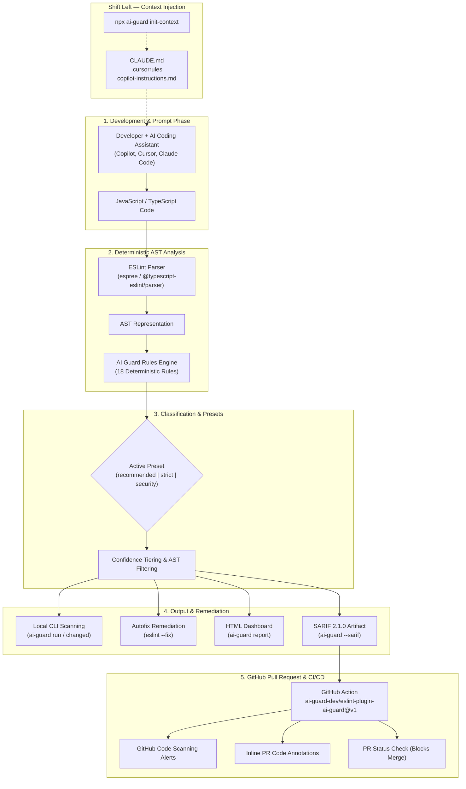
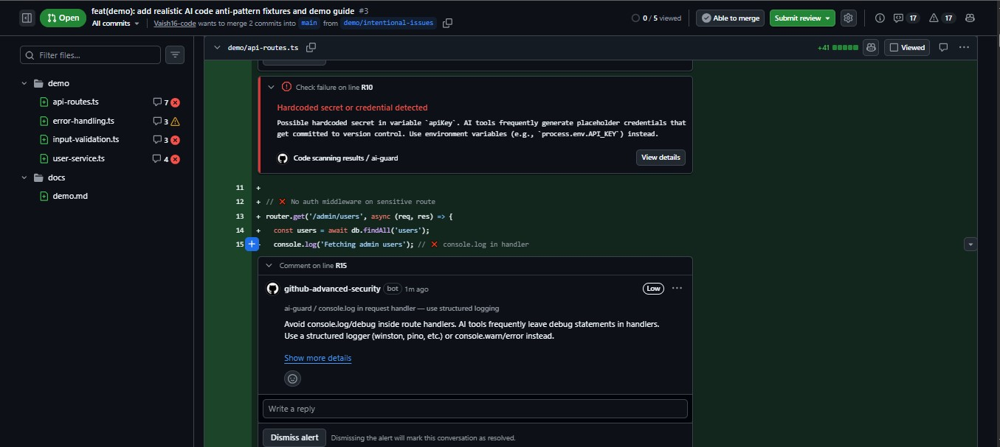
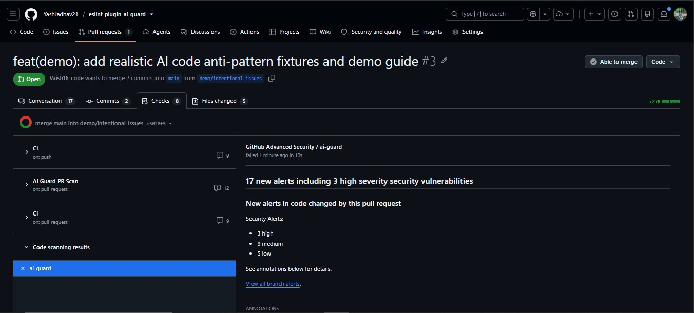
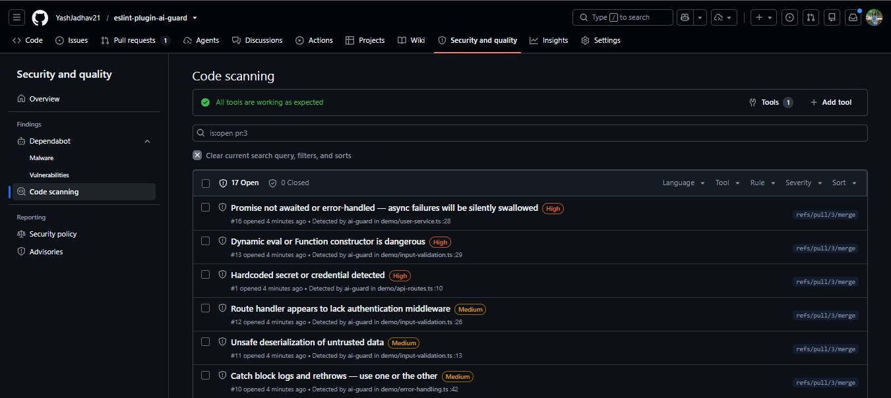

<p align="center">
  <a href="https://getaiguard.dev">
    
  </a>
</p>

<h1 align="center">AI Guard</h1>

<p align="center">
  <strong>Deterministic AST safety layer and CI guardrails for AI-assisted JavaScript and TypeScript code.</strong>
</p>

<p align="center">
  <a href="https://getaiguard.dev"><strong>Website</strong></a> &nbsp;•&nbsp;
  <a href="https://www.npmjs.com/package/eslint-plugin-ai-guard"><strong>npm Package</strong></a> &nbsp;•&nbsp;
  <a href="https://github.com/ai-guard-dev/eslint-plugin-ai-guard"><strong>GitHub Repository</strong></a> &nbsp;•&nbsp;
  <a href="./docs/rules/"><strong>Rules Catalog</strong></a> &nbsp;•&nbsp;
  <a href="./docs/getting-started.md"><strong>Documentation</strong></a>
</p>

<p align="center">
  <a href="https://www.npmjs.com/package/eslint-plugin-ai-guard"></a>
  <a href="https://github.com/ai-guard-dev/eslint-plugin-ai-guard/actions/workflows/ci.yml"></a>
  <a href="https://www.npmjs.com/package/eslint-plugin-ai-guard"></a>
  <a href="https://github.com/ai-guard-dev/eslint-plugin-ai-guard/blob/main/LICENSE"></a>
  <a href="https://github.com/ai-guard-dev/eslint-plugin-ai-guard/blob/main/SECURITY.md"></a>
  <a href="https://getaiguard.dev"></a>
</p>

---

## What is AI Guard?

**AI Guard** (`eslint-plugin-ai-guard`) is a deterministic ESLint plugin, CLI, and GitHub Action engineered to detect reliability bugs, async hazards, security vulnerabilities, and code-scaffolding defects frequently introduced during AI-assisted development (GitHub Copilot, Cursor, Claude Code, Gemini Code Assist, etc.).

AI Guard analyzes Abstract Syntax Trees (AST) using ESLint's native engine. It runs locally in your editor, in your terminal via the zero-config CLI, and in your CI/CD pipelines via native SARIF 2.1.0 integration with GitHub Code Scanning.

### What AI Guard is NOT

> [!IMPORTANT]
> - **AI Guard is NOT an AI detector.** It does not attempt to predict whether code was authored by an LLM or a human.
> - **AI Guard detects dangerous or fragile code patterns** that LLMs repeatedly introduce due to incomplete context, hallucinated patterns, or probabilistic generation.
> - **AI Guard does NOT replace ESLint.** It extends ESLint with 18 specialized, high-impact rules that core ESLint and standard configurations omit.

---

## Why AI Guard?

AI coding assistants write code at remarkable velocity, but generated code repeatedly suffers from predictable reliability and security anti-patterns that conventional linters miss:

| Pattern | Why AI Assistants Generate It | Real-World Impact |
| :--- | :--- | :--- |
| **Floating Promises** | Omits `await`, `return`, or `.catch()` on async calls | Unhandled promise rejections, silent failures in background jobs |
| **Async Array Iteration** | Passes async callbacks into `array.map()` or `.filter()` | Returns unawaited `Promise[]` instead of resolved values |
| **Sequential Awaits in Loops** | Loops over items with sequential `await` | Significant latency bottlenecks; blocks event loop execution |
| **Empty Catch Blocks** | Inserts generic `try { ... } catch (e) {}` blocks | Swallows production exceptions silently without telemetry |
| **Hardcoded Secrets** | Injects placeholder or real API keys/tokens | Credential leakage in version control and deployment bundles |
| **Dynamic `eval()`** | Generates dynamic function compilation | Arbitrary code execution and code injection |
| **Raw SQL Concatenation** | Concatenates query strings with variables | Severe SQL injection vulnerabilities |
| **Unsafe Deserialization** | Calls `JSON.parse(req.body)` directly without schema checks | Denial of service and unhandled runtime crashes |
| **Missing Route Auth & Authz** | Emits boilerplate endpoints without auth middleware | Unprotected API endpoints and IDOR privilege escalations |
| **Dead Branches & Scaffolding** | Leaves `if (true)` or conflicting conditions from prompt iterations | Bloated bundles and dead code paths |

AI Guard provides an instantaneous, deterministic feedback loop that catches these issues before they reach pull requests or production.

---

## Architecture & Workflow



---

## Rules Catalog

AI Guard includes **18 deterministic rules** divided into four specialized categories. Every rule is engineered with low false-positive heuristics and validated against real-world production codebases:

### 🔴 Security (6 Rules)

| Rule | Recommended | What It Catches | Fixable? |
| :--- | :---: | :--- | :---: |
| [`no-hardcoded-secret`](./docs/rules/no-hardcoded-secret.md) | **`error`** | API keys, bearer tokens, passwords, and private keys committed directly in source code. | **Yes** (`process.env.*`) |
| [`no-eval-dynamic`](./docs/rules/no-eval-dynamic.md) | **`error`** | `eval()`, `new Function()`, and `setTimeout`/`setInterval` with dynamic/non-literal string expressions. | No |
| [`no-sql-string-concat`](./docs/rules/no-sql-string-concat.md) | `warn` | SQL queries constructed by string concatenation or raw template literals — SQL injection risks. | No |
| [`no-unsafe-deserialize`](./docs/rules/no-unsafe-deserialize.md) | `warn` | Unchecked `JSON.parse()` called directly on HTTP request inputs (`req.body`, `req.query`, `req.params`). | No |
| [`require-auth-middleware`](./docs/rules/require-auth-middleware.md) | `warn` | Express and Fastify route definitions exposed without authentication middleware. | No |
| [`require-authz-check`](./docs/rules/require-authz-check.md) | `warn` | Endpoints accessing sensitive resources or user IDs without tenant/ownership authorization checks. | No |

### 🟠 Reliability (4 Rules)

| Rule | Recommended | What It Catches | Fixable? |
| :--- | :---: | :--- | :---: |
| [`no-empty-catch`](./docs/rules/no-empty-catch.md) | **`error`** | Empty `catch (e) {}` blocks that silently swallow exceptions without logging or rethrowing. | **Yes** (inserts `/* TODO: handle error */`) |
| [`no-broad-exception`](./docs/rules/no-broad-exception.md) | `warn` | Catching broad exception types like `catch (e: any)` that mask system faults and typing. | No |
| [`no-catch-log-rethrow`](./docs/rules/no-catch-log-rethrow.md) | `off`* | Catch blocks that only log to `console` and rethrow without adding context or diagnostic info. | No |
| [`no-catch-without-use`](./docs/rules/no-catch-without-use.md) | `off`* | Caught error variables that are declared in catch parameters but never referenced. | No |

### 🟡 Async Stability (5 Rules)

| Rule | Recommended | What It Catches | Fixable? |
| :--- | :---: | :--- | :---: |
| [`no-floating-promise`](./docs/rules/no-floating-promise.md) | **`error`** | Async function invocations without `await`, `.catch()`, or `return` — leading to silent dropped errors. | **Yes** (marks with `void`) |
| [`no-async-array-callback`](./docs/rules/no-async-array-callback.md) | `warn` | Async callbacks passed to `map()`, `filter()`, `forEach()`, or `reduce()` returning `Promise[]`. | No |
| [`no-await-in-loop`](./docs/rules/no-await-in-loop.md) | `warn` | Sequential `await` in loops where iterations can be safely executed concurrently with `Promise.all`. | **Yes** (rewrites to `Promise.all`) |
| [`no-async-without-await`](./docs/rules/no-async-without-await.md) | `warn` | Functions declared `async` that never execute an `await` expression, adding unnecessary Promise overhead. | No |
| [`no-redundant-await`](./docs/rules/no-redundant-await.md) | `off`* | Redundant `return await` statements outside of `try...catch` blocks. | No |

### 🔵 AI Patterns (3 Rules)

| Rule | Recommended | What It Catches | Fixable? |
| :--- | :---: | :--- | :---: |
| [`no-dead-branch`](./docs/rules/no-dead-branch.md) | `warn` | Unreachable or tautological branches (`if (true)`, `if (false)`, `x && !x`) left behind from LLM code synthesis. | No |
| [`no-duplicate-logic-block`](./docs/rules/no-duplicate-logic-block.md) | `off`* | Consecutive duplicate code blocks or repeated conditional branches duplicated during AI edits. | No |
| [`no-console-in-handler`](./docs/rules/no-console-in-handler.md) | `off`* | Unstructured `console.log` statements left in HTTP route handlers instead of production loggers. | No |

*\* Enabled at `error` level in the `strict` preset.*

---

## Presets

AI Guard exports three official configurations ready for flat config or legacy setups:

| Preset | Description | Configuration Focus |
| :--- | :--- | :--- |
| **`recommended`** | **Default.** Balanced adoption preset. Enables 4 high-confidence critical rules at `error`, 9 context-sensitive rules at `warn`, and disables 5 noisy rules. Zero noise on day one. | Production codebases, new teams |
| **`strict`** | Enforces **all 18 rules at `error`**. Designed for zero-tolerance CI gates, high-assurance software, and mature teams. | Strict CI/CD quality gates |
| **`security`** | Focuses exclusively on the **6 security rules** (`no-hardcoded-secret`, `no-eval-dynamic`, `no-sql-string-concat` at `error`; remainder at `warn`). | AppSec auditing & security scans |

---

## Quick Start & Installation

Install the package as a development dependency using your package manager:

```bash
# npm
npm install --save-dev eslint-plugin-ai-guard

# pnpm
pnpm add -D eslint-plugin-ai-guard

# yarn
yarn add -D eslint-plugin-ai-guard

# bun
bun add -d eslint-plugin-ai-guard
```

### Requirements

- **Node.js:** `>= 20.0.0`
- **ESLint:** `>= 8.0.0` (Supports both Flat Config and legacy configs)
- **TypeScript (optional):** `@typescript-eslint/parser >= 6.0.0` for TypeScript AST parsing

---

## ESLint Configuration

### 1. Modern Flat Config (`eslint.config.mjs` / `eslint.config.js`)

AI Guard exports full native support for modern ESLint Flat Config:

```javascript
// eslint.config.mjs
import aiGuard from 'eslint-plugin-ai-guard';

export default [
  {
    plugins: {
      'ai-guard': aiGuard,
    },
    rules: {
      ...aiGuard.configs.recommended.rules,
      // Custom overrides if desired:
      'ai-guard/no-floating-promise': 'error',
    },
  },
];
```

To use the `strict` or `security` preset in flat config:

```javascript
// Strict preset — all 18 rules at error
rules: {
  ...aiGuard.configs.strict.rules,
}

// Security preset — security rules only
rules: {
  ...aiGuard.configs.security.rules,
}
```

### 2. Legacy Config (`.eslintrc.js` / `.eslintrc.json`)

```javascript
// .eslintrc.js
module.exports = {
  plugins: ['ai-guard'],
  extends: ['plugin:ai-guard/recommended'],
};
```

---

## CLI Reference

AI Guard includes a full-featured CLI binary (`ai-guard`) that runs out of the box with zero ESLint configuration files required:

```bash
npx ai-guard <command> [options]
```

### Core Commands

| Command | Purpose | Common Options |
| :--- | :--- | :--- |
| `run` | Scan your workspace using AI Guard AST rules | `--path <dir>`, `--strict`, `--security`, `--json`, `--sarif`, `--fail-on <level>`, `--max-warnings <n>` |
| `changed` | Fast CI scan — only scans modified files in git | `--pr`, `--staged`, `--base <branch>`, `--strict`, `--sarif`, `--sarif-output <file>`, `--fail-on <level>` |
| `init` | Automatically detect environment & configure ESLint | `--preset <name>`, `--flat`, `--dry-run`, `-y, --yes` |
| `init-context` | Generate prompt instruction files for AI coding agents | `-a, --all`, `--force`, `--dry-run`, `--rules <categories>` |
| `doctor` | Diagnose your ESLint, parser, and plugin environment | (No options needed — prints actionable diagnostic report) |
| `baseline` | Snapshot current issues to track only new regressions | `--save`, `--check`, `--mode <strict\|stable>`, `--preset <name>` |
| `report` | Generate an interactive standalone HTML audit report | `--path <dir>`, `--preset <name>`, `--output <file>`, `--no-open`, `--json` |
| `preset` | Interactively select and switch active preset in config | (Interactive prompt with automatic config patch & backup) |
| `ignore` | Add standard ignore paths (`.next`, `dist`, `build`) to config | (Patches flat config or legacy ignores safely) |

### CLI Usage Examples

```bash
# 1. Immediate scan of current directory
npx ai-guard run

# 2. Strict CI scan failing only on high-confidence issues
npx ai-guard run --strict --fail-on high

# 3. Pull Request scan (diffs against PR target branch)
npx ai-guard changed --pr --sarif --sarif-output results.sarif

# 4. Generate AI agent guardrails for Cursor, Claude Code, and Copilot
npx ai-guard init-context --all

# 5. Generate interactive HTML diagnostic report
npx ai-guard report --output ai-guard-report.html

# 6. Save existing issues as baseline and only fail on new regressions
npx ai-guard baseline --save
npx ai-guard baseline --check
```

---

## AI Agent Integration (`init-context`)

Standard linters only run **after** code has already been written. The `init-context` command shifts your guardrails left by embedding AI Guard's rules directly into the instruction files loaded by your AI coding tools:

```bash
npx ai-guard init-context --all
```

This generates three targeted context files:
1. **`CLAUDE.md`** — Automatically loaded by **Claude Code**
2. **`.cursorrules`** — Automatically loaded by **Cursor**
3. **`.github/copilot-instructions.md`** — Automatically loaded by **GitHub Copilot**

### How Shift-Left Works

```
AI Guard (init-context)
       ↓
Generates project guardrail files (CLAUDE.md, .cursorrules, copilot-instructions.md)
       ↓
AI coding assistant reads safety rules before generating code
       ↓
Model avoids floating promises, empty catches, and hardcoded secrets at prompt time
       ↓
AI Guard CLI & GitHub Action deterministically verifies the output in CI
```

This dual-layer defense minimizes review friction and ensures generated code meets your security standard on the first pass.

---

## GitHub Action

The official AI Guard GitHub Action runs on PRs, detects changed files, provides step summaries, outputs SARIF 2.1.0, and posts inline PR annotations directly on GitHub:

```yaml
# .github/workflows/ai-guard.yml
name: AI Guard

on:
  pull_request:
    branches: [main, develop]
  push:
    branches: [main]

jobs:
  ai-guard-scan:
    name: AI Guard Code Review
    runs-on: ubuntu-latest

    permissions:
      contents: read
      security-events: write
      actions: read

    steps:
      - name: Checkout Code
        uses: actions/checkout@v4
        with:
          fetch-depth: 0 # Required for git diff comparison

      - name: Setup Node.js
        uses: actions/setup-node@v4
        with:
          node-version: 20
          cache: 'npm'

      - name: Run AI Guard
        uses: ai-guard-dev/eslint-plugin-ai-guard@v1
        with:
          preset: 'recommended'
          fail-on: 'high'
          changed-only: 'true'
          upload-sarif: 'true'
```

### Action Inputs (`action.yml`)

| Input | Description | Default |
| :--- | :--- | :---: |
| `preset` | Rule preset: `recommended` \| `strict` \| `security` | `'recommended'` |
| `fail-on` | Severity threshold to fail CI: `high` \| `medium` \| `any` \| `none` | `'high'` |
| `changed-only` | Scan only files changed in this PR / commit | `'true'` |
| `path` | Target file or directory to scan | `'.'` |
| `upload-sarif` | Upload results to GitHub Code Scanning | `'true'` |
| `github-summary` | Write an execution breakdown to the GitHub Actions Job Summary | `'true'` |
| `working-directory`| Working directory for scanning (ideal for monorepos) | `'.'` |
| `package-manager` | Package manager: `auto` \| `npm` \| `pnpm` \| `yarn` | `'auto'` |
| `sarif-output` | Output filepath for generated SARIF report | `'ai-guard-results.sarif'` |
| `install-deps` | Install project dependencies prior to scanning | `'true'` |

### Action Outputs

| Output | Description |
| :--- | :--- |
| `issues-found` | Total number of issues found across scanned files |
| `high-confidence-count` | Number of high-confidence issues flagged |
| `medium-confidence-count` | Number of medium-confidence issues flagged |
| `files-scanned` | Count of files analyzed during the execution |
| `sarif-file` | Absolute path to the generated SARIF 2.1.0 artifact |
| `duration-ms` | Total scan execution duration in milliseconds |

---

## SARIF & GitHub Code Scanning

AI Guard natively outputs **SARIF 2.1.0** (`Static Analysis Results Interchange Format`). When uploaded via the GitHub Action or `github/codeql-action/upload-sarif@v3`, findings integrate directly with GitHub Advanced Security:

- **Inline PR Annotations:** Direct comments on the exact source lines where flaws exist.
- **Security Dashboard:** Persistent alerts under your repository's `Security → Code scanning` tab.
- **Merge Protection:** Block merges automatically when high-confidence security or async bugs are detected.

### Visual Previews

#### Inline Pull Request Annotations


#### GitHub Advanced Security Summary


#### Persistent Code Scanning Dashboard


---

## Rule Examples (Before & After)

### 1. `no-floating-promise` (Unhandled Promises)

```typescript
// ❌ BAD: Floating promise. Errors are dropped silently.
async function syncUserProfile(user: User) {
  sendTelemetryEvent('user_sync', user.id);
  database.save(user);
}

// ✅ GOOD: Awaited, explicitly handled, or marked with void
async function syncUserProfile(user: User) {
  await database.save(user);
  void sendTelemetryEvent('user_sync', user.id); // Explicitly unhandled
}
```

### 2. `no-hardcoded-secret` (Committed Credentials)

```typescript
// ❌ BAD: Secret committed inline
const client = new PaymentGateway({
  apiKey: 'sk-prod-983427598273498273948273',
});

// ✅ GOOD: Read from environment variable (Autofixable!)
const client = new PaymentGateway({
  apiKey: process.env.API_KEY,
});
```

### 3. `no-await-in-loop` (Sequential Latency Trap)

```typescript
// ❌ BAD: Consecutive awaits block each iteration sequentially
async function fetchAllUsers(ids: string[]) {
  const users = [];
  for (const id of ids) {
    users.push(await fetchUser(id));
  }
  return users;
}

// ✅ GOOD: Concurrently fetched with Promise.all (Autofixable!)
async function fetchAllUsers(ids: string[]) {
  return await Promise.all(ids.map((id) => fetchUser(id)));
}
```

### 4. `no-empty-catch` (Swallowed Errors)

```typescript
// ❌ BAD: Exception swallowed without trace
try {
  parseConfiguration(rawConfig);
} catch (e) {}

// ✅ GOOD: Logged, rethrown, or documented (Autofixable!)
try {
  parseConfiguration(rawConfig);
} catch (e) {
  logger.error('Configuration parsing failed', { error: e });
  throw e;
}
```

### 5. `no-sql-string-concat` (SQL Injection)

```typescript
// ❌ BAD: Dynamic string interpolation in SQL
const query = `SELECT * FROM users WHERE organization_id = '${orgId}' AND role = '${role}'`;
await db.query(query);

// ✅ GOOD: Parameterized query binding
const query = 'SELECT * FROM users WHERE organization_id = $1 AND role = $2';
await db.query(query, [orgId, role]);
```

---

## Automatic Remediation (Autofix)

Rules that have deterministic solutions provide automatic autofix handlers. Run ESLint's native `--fix` flag to automatically resolve them:

```bash
npx eslint . --fix
```

| Rule | Automatic Fix Behavior |
| :--- | :--- |
| `no-hardcoded-secret` | Replaces hardcoded string literal with `process.env.VARIABLE_NAME` |
| `no-empty-catch` | Inserts `/* TODO: handle error */` comment to prevent silent swallowing |
| `no-floating-promise` | Prepends `void ` expression to intentionally unawaited calls |
| `no-await-in-loop` | Rewrites straightforward sequential loops to `await Promise.all(...)` |

---

## Performance & Philosophy

- **Zero LLM Overhead:** AI Guard does not call external APIs, does not incur token costs, and does not add LLM latency. A scan of 100+ files executes in milliseconds.
- **100% Deterministic:** Every finding is derived strictly from Abstract Syntax Tree analysis. No probabilistic drift, no non-deterministic hallucinated findings.
- **Low False Positives:** Built with precision-first design. Context-sensitive rules are configured at `warn` or `off` in the recommended preset so developers are never blocked by noise.
- **Self-Scanning:** AI Guard enforces its own rules on its own codebase in CI using the `strict` preset.

---

## Learn More & Ecosystem

Visit [getaiguard.dev](https://getaiguard.dev) to explore interactive documentation, rule catalogs, benchmarks, and deep-dive engineering articles.

### Official Links

- **Website:** [https://getaiguard.dev](https://getaiguard.dev)
- **GitHub Organization:** [https://github.com/ai-guard-dev](https://github.com/ai-guard-dev)
- **Repository:** [https://github.com/ai-guard-dev/eslint-plugin-ai-guard](https://github.com/ai-guard-dev/eslint-plugin-ai-guard)
- **npm Registry:** [https://www.npmjs.com/package/eslint-plugin-ai-guard](https://www.npmjs.com/package/eslint-plugin-ai-guard)
- **GitHub Action:** [ai-guard-dev/eslint-plugin-ai-guard@v1](https://github.com/ai-guard-dev/eslint-plugin-ai-guard)

---

## Contributing

We welcome contributions, new rule ideas, bug reports, and false-positive reports!

1. Check out our [Contributing Guide](CONTRIBUTING.md) for local setup and testing standards.
2. Review our [Security Policy](SECURITY.md) to report vulnerabilities responsibly.
3. Check open issues or submit new ones on our [Issue Tracker](https://github.com/ai-guard-dev/eslint-plugin-ai-guard/issues).

---

## License

[MIT](LICENSE) © AI Guard Authors. Free and open source forever.
